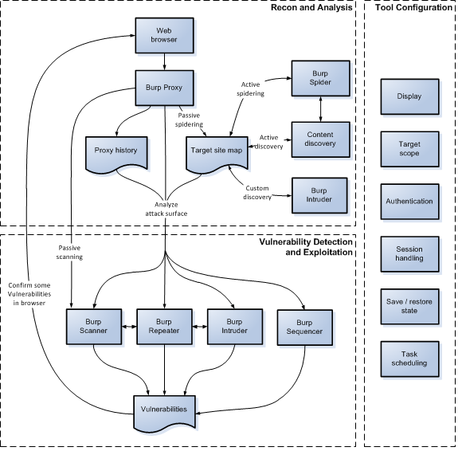

# 1 Burp Suite 概要

## 1.1 Burp Suiteとは

Burp SuiteはPortSwigger 社が作成したJava製のローカルProxyソフトです。ローカルProxyとは、会社や学校などで使用されているProxyとは異なり、Webアプリケーションのセキュリティ診断やデバックなどに活用されます。Burp SuiteはWebアプリケーションのセキュリティ診断に特化したツールで、Burp Suite以外にもOWASP ZAPやFiddlerなどが存在しています。

Burp Suite　 [http://portswigger.net/](http://portswigger.net/)

## 1.2 特徴

Burp Suiteは、プロフェッショナル版（Professional Edition）とフリー版（Free Edition）の2種類あります。最新バージョンは、フリー版v1.7.03で、プロフェッショナル版v1.7.02betaです（2016年7月19日時点）。

Burp Suiteは以下の機能で構成されており、プロフェッショナル版でしか利用できない機能もあります。

| 機能 | 概要 |
|:-----------|:------------|
| Target | 一部有償機能で、対象サイトの詳細情報を収集するsite mapの作成やターゲットとなるスコープを設定します。 |
| Proxy | ブラウザとWebサーバの間でリクエスト・レスポンスを仲介し、リクエスト・レスポンスの内容変更などの制御を行います。 |
| Spider | 事前に設定されたスコープ内で自動巡回し、コンテンツの洗い出しを行います。 |
| Scanner | 有償機能で、アクティブスキャン(動的解析)およびパッシブスキャン(静的解析)による脆弱性スキャンを行います。 |
| Intruder | 定型化されたパターンによる自動的なスキャンを行います。Scannerとは異なり、結果の分析は行いません。　|
| Repeater | リクエストを手動で修正し再送付します。 |
| Sequencer | トークンなどのランダム性を解析します。 |
| Decoder | BASE64などのエンコード・デコードやhash算出を行います。 |
| Comparer | リクエスト、レスポンスの差分を表示します。 |
| Extender | BApp Storeや独自の拡張プログラムを制御します。 |
| User Options | UIなどBurpの実行環境に関するオプションを設定します。 |
| Project Options | Projectに関するオプションを設定します。 |
| Alerts | エラーメッセージなどを出力します。 |
| その他 | Userオプション、Projectオプションの保存や読み込みなどを行います。 |

## 1.3 診断プロセス

Burpは効果的に手動と自動による診断を組み合わせる必要があります。ブラウザを用いて対象となるアプリケーションへアクセスし、情報を収集します。収集した情報を分析し、必要に応じてBurpの設定を変更します。設定後、脆弱性スキャンを行います。

- 対象アプリケーションの調査(Recon and Analysis)
- 各機能の設定(Tool Configuration)
- 脆弱性スキャン(Vulnerability Detection and Exploitation)

### 対象アプリケーションの調査(Recon and Analysis)

手動でブラウザを操作し、対象アプリケーションをマッピングします。Proxy historyとTargetのsite mapにすべてのリクエストが登録されていきます。site mapはレスポンスに存在するリンクやフォームなどからコンテンツの存在を予測します。必要に応じて自動的なマッピングとして、Spiderを活用したsite mapにある未送付のリクエストの自動的な遷移による洗い出しを行います。ただし、Spiderの場合、自動的にアクセスを試行するため事前に設定をよく確認してください。

### 各機能の設定(Tool Configuration)

対象となるアプリケーションでBurpが動作するように、Burpの設定を確認、変更します。ポイントとしては以下です。

- ディスプレイ

HTTPログを表示するためのフォントや文字コードを変更します。日本語に対応していないフォントの場合、日本語が正常に表示されないため、対応したフォントなどを選択してください。

- スコープ

対象とする範囲(スコープ)を設定します。設定することでProxy historyやTarget site mapでの表示内容を制限したり、インターセプトするリクエスト・レスポンスやSpider、Scannerの実行範囲を制限することができます。そのため、誤ってほかの環境へのアクセスをしなくすることも可能です。

- 認証

BASIC認証などの認証を設定します。

- セッション管理

多くのアプリケーションでセッション管理が行われています。トークンを用いたり、複数のアクセスが必要な場合などがあり、Session Handling RulesおよびMacroを用いることで多くのケースで対応が可能です。

- ログの保存

フリー版の場合、stateファイルおよびProjectファイルの作成ができないため、Loggingによるログの保存またはextensionなどの拡張機能を用いて行う必要があります。

### 脆弱性スキャン(Vulnerability Detection and Exploitation)

対象アプリケーションの調査、必要な設定を実施後、脆弱性スキャンを実施します。ただしただし、フリー版ではScannerは利用することができないため、Proxyでインターセプトしたリクエストを変更するか、IntruderまたはRepeaterを利用する必要があります。

