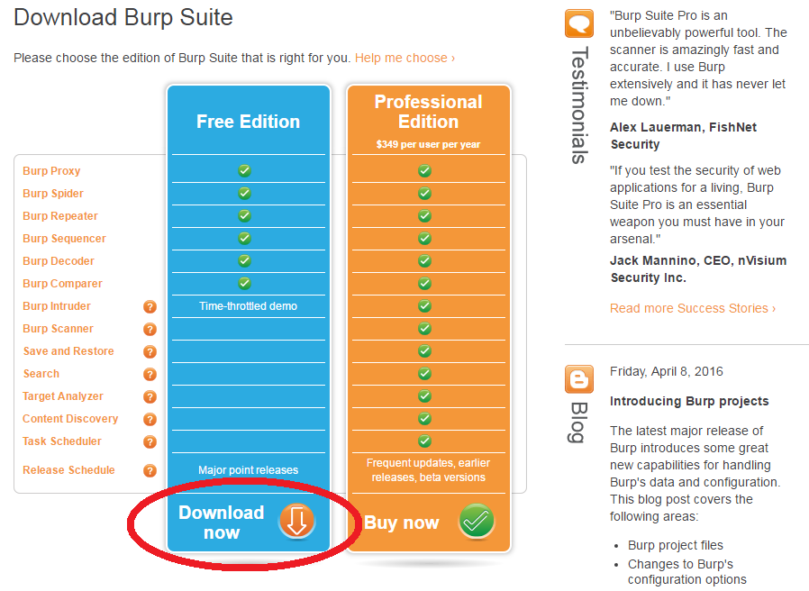
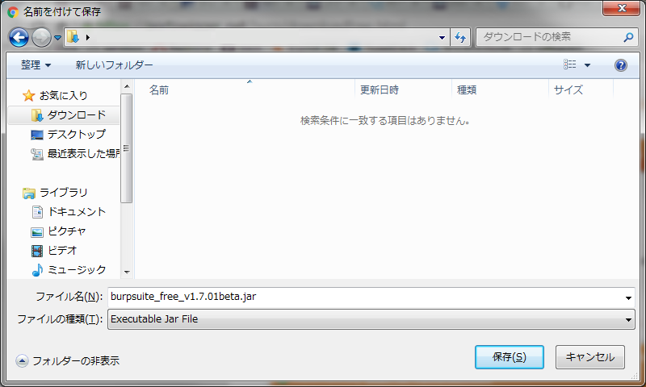

# 2 インストール手順

## 2.1 Windows版インストール手順

Burp Suiteは実行可能なJARファイルとなっており、フリー版はPortSwigger社のサイトよりダウンロードが可能です。JARを実行するためにJavaの実行環境を用意する必要があります。

### 2.1.1 Java実行環境の準備

BrupのJARファイルはJava Runtime Enviroment(JRE)で実行可能です。また、JARファイル自体を解凍する必要はありません。まず最初にJavaがインストールされているか確認します。

1. コマンドプロンプトで"java -version"を実行します。
2. Javaがインストールされている場合、java version "1.8.0_91"のようなメッセージが表示されます。また、Burpはv1.6以降のJavaが必要となります。ただし、Java v1.6などのすでにサポートがされていないバージョンをご利用の場合、サポートされたバージョンへの移行を強く推奨します。
3. Javaがインストールされていない場合やv1.5などの古いバージョンの場合、Oracle社のサイト( http://www.oracle.com/technetwork/java/javase/downloads/index.html )よりJREをダウンロードし、インストールします。

JREのインストールが完了したら手順2を実施し、正常にインストールができているか確認してください。

### 2.1.2 Burp Suiteのダウンロード

JREのインストールが完了したら、Burp Suiteのフリー版を https://portswigger.net/burp/download.html からダウンロードします。

任意のフォルダにダウンロードします。

