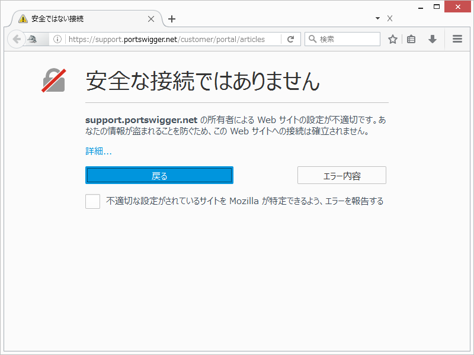

# 4 診断方法について
## 4.1 Proxy機能
### 4.1.1 Proxyを利用した通信キャプチャ
一般的なクライアントProxytoolに関する説明
MITMやっているようなお決まりの絵と内容を説明をするイメージ
見るだけじゃなくて変更もできるよ。SSLもイケますよ。みたいなことを書く。

### 4.1.2 Proxyタブの構成
Proxyタブを構成する各タブに関する簡単な概要の説明
- Intercept
- HTTP history
- WebSockets history
- Options

## 4.2 Burp Suiteによる通信のキャプチャ
### 4.2.1 通信をキャプチャしてみよう！
1. ブラウザでアクセスする(※この時以下二点の設定状況を確認)
  - ブラウザ側で、3章で説明したProxy設定がされていること
  - 「Intercept」タブが「Intercept is off」と設定されていること
2. 「HTTP hisotry」タブで通信内容を閲覧  
  「HTTP hisotry」タブの画面構成及び見方について説明
  上部フィールドについての説明(以下の情報が表示されている)
    - Host
    - Method
    - URL
    - Params
    - Edited
    - Status
    - Length
    - MIME type
    - Extension
    - title
    - Comment
    - SSL
    - IP
    - Cookies
    - Time
    - Listener port

  選択すると下部タブにRequest＆Pesponseデータの詳細を閲覧できる
  下部タブの詳細について説明(Requestタブと Pesponseタブ)
  以下タブにて項目ごとにデータを表示可能
    - Raw
    - Params
    - Headers
    - Hex

  Filetr機能の説明

### 4.2.2 値を書き換えて送信してみよう！
1. ブラウザでアクセスする(※この時以下二点の設定状況を確認)
  - ブラウザ側で、3章で説明したProxy設定がされていること
  - 「Intercept」タブが「Intercept is on」と設定されていること
2. 「Intercept」タブで値を変更  
「Intercept」タブの画面構成及び見方について説明
  - 上部ボタン
    - Forward
    - Drop
    - Intercept on or off
    - Action
  - 下部タブ
    - Raw
    - Params
    - Headers
    - Hex
3. 「HTTP hisotry」タブで結果を閲覧  
「Edited request」のタブに関する説明    
requestだけじゃなくてresponseのインターセプトについても補足する

## 4.3 その他

### 4.3.1 リクエストの再送信

リピーターの機能概要説明
リピーターがリクエストを新規に作成、Historyに記録されたリクエストをコピーし、テストリクエストを送信することを説明

1． Historyからリクエストのコピー
2． リクエストの変更
3． リクエストの送信
4． レスポンスの確認

### 4.3.2 Scope設定

スコープ設定の機能概要説明
スコープに設定した条件を満たさないリクエストに対して誤って検査をしない為に、Proxy Historyに表示しないようにしたり、スコープ外のリクエストをInterceptしないようにできることを説明
スコープの設定手順について説明

### 4.3.3 サーバ証明書設定

暗号化通信（https://～）が必要なWebアプリケーションに、デフォルト設定のBurp Suiteでアクセスすると、ブラウザに送信された証明書が不正であることを伝えるセキュリティ警告画面が表示されます。

図4-3-3-a Firefoxのセキュリティ警告画面

セキュリティ警告画面が表示される原因は、Burp Suiteが起動時に独自に生成したCA証明書により署名された自己署名証明書を接続に使用しているためです。

一時的に例外としてBurp Suite独自の証明書を受け入れると、暗号化されている通信内容をBurp Suite上で平文で確認することが可能になります。しかし、警告のたびに操作をするのは煩わしいうえに、Webアプリケーションの設定によっては、自己署名証明書を使用して接続できない場合があります。

そのため、暗号化通信を効率よく取り扱うために、Burp Suiteの独自CA証明書をOSあるいはブラウザにインポートする必要があります。

なお、FirefoxはCA証明書を独自に管理しています。そのため、WindowsとOS XおよびFirefoxの3パターンについて解説します。

#### 独自CA証明書の保存

すべてのパターンで共通する操作はBurp Suiteが生成した独自CA証明書の保存です。

1. ブラウザのプロキシ設定がBurp Suiteに接続するようになっていることを確認
1. http://burp/ にアクセスして「CA certificate」リンクをクリック
1. 任意の名前でCA証明書を保存

#### Windows

1. Windowsの「インターネットオプション」（inetcpl.cpl）→「コンテンツ」→「証明書」ボタンをクリック
1. 「インポート...」をクリックして証明書ファイルを選択し、証明書ストアから「信頼されたルート証明機関」を選択してインポート
1. 「セキュリティ警告」ダイアログで「はい」をクリック

#### OS X

OS Xの場合は「キーチェーンアクセス」アプリにより設定します。

1. 「Launchpad」→「その他」から「キーチェーンアクセス」アプリを起動
1. 左上の南京錠が閉じている場合はクリックしてパスワードを入力してロックを解除
1. 「キーチェーン」で「ログイン」を選択し、「分類」で「証明書」を選択
1. 「ファイル」→「読み込む...」で保存したCA証明書を読み込み
1. 読み込んだ「PortSwigger CA」をダブルクリック
1. 「▶信頼」を展開し、「この証明書を使用するとき」プルダウンリストで「常に信頼」を選択
1. パスワードを入力して「設定をアップデート」ボタンをクリック

#### Firefox

1. ブラウザの設定「オプション」→「詳細」→「証明書」→「証明書を表示...」クリックで「証明書マネージャ」を表示
1. 「インポート...」ボタンをクリックして保存した証明書を「開く」
1. 「証明書のインポート」ダイアログで「この認証局によるWebサイトの識別を信頼する」にチェックを入れて「OK」ボタンをクリック

### 4.3.4 ログ保存設定

1.[Options]-[Misc]-Logging]の設定
ALLとToolsの使い分け、RequestとResponse

2.ログの見方

3.[参考]Logger++の紹介

### 4.3.5 アップストリームProxy設定

1.背景
- 社内Proxyの図
  - Proxy Host
  - Proxy Port

2.設定
  - 具体的な設定値例(図)
    - Desitination Hostに*(ワイルドカード)入れる話は必須
    - 認証方式、ID/PWD

3.Burp特有の問題と対策
  - 名前解決遅くなる問題
  - Connection timeout待ちで遅い問題

### 4.3.6 Intruder

1.自動化の必要性

2.使い方
  - Instuderへの渡し方
    - History右クリックからのsend IntruderあるいはCtrl+i
  - Positions設定
    - 自動設定
    - 手動設定(微調整)
  - Payloads
    - Payload Type
    - Payload Options(Simple List)
  - 実行結果と見方

3.便利な使い方
  - Grep Match
  - Automatic Payload Position

### 4.3.7 Extender

- Extensionの取り込み方について記載する。
- BApp Storeの説明を記載する。
- Jython、JRubyの設定について記載する。
- APIについて記載する(具体的な内容は触れず、javadocがあるよ程度)
