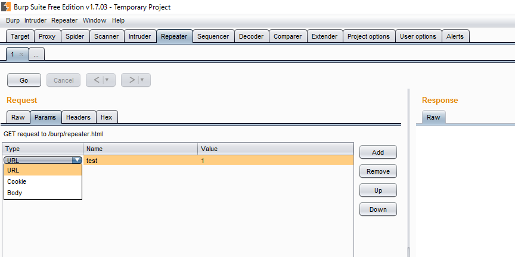
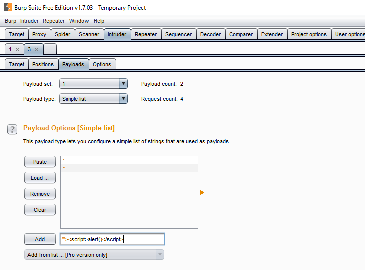
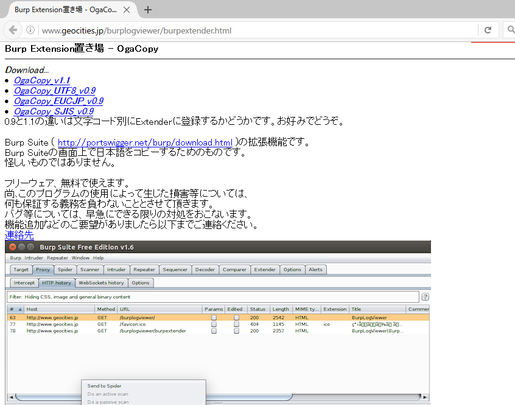

# 4 診断方法について
## 4.1 Proxy機能
### 4.1.1 Proxyを利用した通信キャプチャ
Burp Suiteは、HTTPやHTTPSをブラウザとWebサーバの間で仲介し、通信内容の参照や書き換えができます。

### 4.1.2 Proxyタブの構成
Proxyタブは複数のタブから構成されており、HTTPログの履歴参照やProxy設定などが行えます。


| タブ | 機能概要 |
|:---------------------|:-----------------------------------------------------------|
| Intercept | HTTPやWebSocketのリクエストやレスポンスをインターセプトし、内容の確認や変更が可能 |
| HTTP history | Proxyを経由したすべてのHTTPログを参照可能 |
| WebSockets history | Proxyを経由したすべてのWebSocketsログを参照可能 |
| Options | Proxyの稼働IPアドレスやポートの設定、インターセプトの条件設定、HTTPログの置換設定など |

## 4.2 Burp Suiteによる通信のキャプチャ
### 4.2.1 通信をキャプチャしてみよう！
Burp Suiteが稼働するIPアドレスおよびポートをブラウザでProxyとして適切に設定すると、Burp Suiteはブラウザのリクエスト・レスポンスを仲介できます。3.3.2のProxy設定が済んでいれば、ブラウザから任意のHTTPページにアクセスしてみてください（HTTPSページの場合は警告が出る場合があるので後述します）。

インターセプトがオンの場合、ブラウザからサーバへのリクエストはBurp Suiteに止められてしまうため、レスポンスがなく、ブラウザは何も表示されません。[Forward]をクリックするか、[Intercept is On]をクリックして[Intercept is Off]にするとインターセプトされていたリクエストがサーバに送信され、ブラウザにWebページが表示されます。

[Proxy]-[HTTP history]には、Burp ProxyがProxyしたHTTPログが一覧で表示されます。以下の項目が表示されます。

- Host
- Method
- URL
- Params
- Edited
- Status
- Length
- MIME type
- Extension
- title
- Comment
- SSL
- IP
- Cookies
- Time
- Listener port


また、各HTTPログを選択すると選択したHTTPログのリクエストおよびレスポンスが下部に表示されます。RequestタブおよびResponseタブそれぞれに以下のタブがあり、表示形式を変更して内容が確認できます。※1はRequestタブのみ、※2はResponseタブでのみ表示されます。

- Raw
- Params ※1
- Headers
- Hex
- HTML ※2
- Render ※2


[HTTP history]の一覧の各カラムをクリックすると降順または昇順での並び替えができます。例えば[Params]をクリックするとHTTPログの中でパラメータが存在するHTTPログが上部に表示されます。
Filterをクリックし条件を設定すると、それに応じて表示するHTTPログをフィルタできます。正規表現でのフィルタ機能はプロフェッショナル版でのみ利用可能です。

| 設定                |  設定内容  |
|:---------------------|:-----------------------------------------------------------|
| Filter by request type | スコープ内のログ、パラメータが存在するリクエストなどが指定できます。 |
| Filter by MIME type | HTML・CSS・ScriptなどのMIMEタイプを指定できます。 |
| Filte by status code | レスポンスのステータスコードを指定できます。 |
| Filter by file extension | URLの拡張子が指定できます。 |
| Filter by annotation | HTTPログにコメントまたは色づけしたもののみ表示できます。 |

### 4.2.2 値を書き換えて送信してみよう！
リクエスト・レスポンスの内容を変更する場合はインターセプトする必要があります。リクエストを改変する場合は[Intercept is On]でインターセプトしたリクエストの内容を変更します。POSTデータを変更した場合Content-Lengthヘッダの値と不整合が起こる場合がありますが、Burp Suiteが変更後の内容をもとにContent-Lengthを再計算しセットするため、意識する必要はありません。

[Foward]はインターセプトしたリクエストをサーバへ送信します。複数のリクエストがインターセプトされている場合、1リクエストごとに[Foward]をクリックする必要があります。


[Drop]はインターセプトしたリクエストを破棄します。サーバへは送信されません。

[Intercept is On]/[Intercept is Off]でインターセプトをするかどうかを設定します。ステータスを[Intercept is Off]に変更するとインターセプトされているすべてのリクエストがサーバに送信されます。

[Actions]では、特定の条件のリクエストをインターセプトしない設定やレスポンスを設定するなど、インターセプトしたリクエストに対するアクションが設定できます。


インターセプトしてリクエストの内容を変更した場合、[Proxy]-[HTTP history]の該当ログで[Edited]がチェックされます。また、下部のタブに[Original request]と[Edited request]が表示され、変更前と変更後のリクエストの内容が確認できます。レスポンスを変更した場合は[Original response]と[Edited response]が表示され、変更前と変更後のレスポンスが確認できます。


## 4.3 その他

### 4.3.1 リクエストの再送信

診断では、リクエストを多数送信します。Repeaterを使用すると、HTTP Historyに記録されているリクエストの再送信や、新規に作成したリクエストの送信ができます。

#### 4.3.1.1 Historyからリクエストの送信

Historyに記録されている既存のリクエストをRepeaterで使用するには、次のように操作してください。

1. Repeaterに送信したいリクエストを[HTTP History]で選択します。
2. 右クリックしコンテキストメニューから[Send To Repeater]を選択し、Repeaterにリクエストを送信します。
3. Repeaterを開きます。


#### 4.3.1.2 リクエストの新規作成

既存のリクエストは元にせず、新規にリクエストを指定するには、次のように操作してください。

1. Repeaterの[...]タブを選択します。
2. 右上にある[Target]をクリックします。
3. 接続先を入力する画面が表示されたら、[Host]と[Port]を入力し、[OK]ボタンを押します。HTTPSでの接続を行う場合は、[Use HTTPS]にチェックを入れます。

#### 4.3.1.3 リクエストの編集、送信

1. 編集したいリクエストのタブを選択します。
2. [Request]の[RAW]タブではHTTPリクエストを直接編集できます。

[Request]-[Params]タブではパラメータを表形式で表示し、変更できます。[Type]を変更すると、パラメータの位置を変更できます。例えば、[Type]を[Body]から[Cookie]に変更すると、ボディパラメータをCookieに移動できます。



[Add]ボタンを押すとパラメーターを追加できます。[Remove]ボタンを押すと選択しているパラメーターを削除できます。[Up]ボタン、[Down]ボタンを押すとパラメーターを送信する順番を変更できます。


[Request]-[Headers]タブではヘッダーを表形式で表示し、変更できます。[Add]ボタンを押すとヘッダーを追加できます。[Remove]ボタンを押すと選択しているヘッダーを削除できます。[Up]ボタン、[Down]ボタンを押すとヘッダーを送信する順番を変更できます。
[Request]-[Hex]タブではリクエストをHexで確認、編集できます。
3. 右上にある「Target」をクリックすると、接続先を変更できます。
4. [Go]ボタンを押し、リクエストを送信します。


#### 4.3.1.4 レスポンスの確認
1. 「Response」の「Raw」タブでは生のHTTPレスポンスを確認できます。
2. 「Response」の「Headers」タブではヘッダーを表形式で表示します。
[Response]-[Hex]タブではレスポンスをHexで表示します。
[Response]-[Render]タブではResponseがHTMLの場合、レスポンスをレンダリングし表示します。


### 4.3.2 Scope設定

診断対象外のアプリケーションに対して診断を実施してはいけません。誤って診断対象外のサーバーやURLを診断しないようにScopeを設定します。Scopeを設定すると、Burp Suiteの動作に以下のような制限がかかります。

- Scopeで設定した条件を満たすリクエストのみをProxy Historyに表示するようフィルタを設定できます。
- Scopeで設定した条件を満たすリクエストのみをInterceptして、リクエストの改ざんができます
- Scopeで設定した条件を満たさないリクエストをSpiderの開始URLとしようとすると、Scopeに追加するか確認するポップアップが表示されます。

| 対象                |  動作  |
|:---------------------|:-----------------------------------------------------------|
| Include in scope | 記述された条件はスコープ内として認識されます。 |
| Exclude from scan | 記述された条件を満たすリクエストはスコープ外として認識されます。 |

デフォルトで、[Exclude from scan]に4つ設定されています。これは、Spider(自動巡回する機能)を実行した際に、ログアウトしてセッションが無効化されないようにログアウト機能と推測される文字列を含むURLにはアクセスしようにようにしているためです。


#### 4.3.2.1 Scopeへの追加

Scopeの追加は3つ方法があります。
1. [Add]ボタンを使用する
2. [Paste URL]ボタンを使用する
3. HTTP historyなどから[Add to scope]を使用する

[Add]ボタンを使用する
1. [Add]ボタンを押します。
2. [Host or IP range]、[Port]、[File]を正規表現で記述します。
3. [OK]ボタンを押します。


[Paste URL]ボタンを使用する
1．Scopeに追加したいURLを、クリップボードにコピーします。
1. [Paste URL]ボタンを押します。

「Add to scope」ボタンを使用する
1. スコープに含めたいHTTPログを選択します。
2. 右クリックしコンテキストメニューから、[Add to scope]をクリックします。


| パターン                |  設定内容  |
|:---------------------|:-----------------------------------------------------------|
| 診断対象がwww.example.comでURLやプロトコルが事前に分からない場合 | [Include in scope]で[Host or IP range]に^www\.example\.com$と設定します。[Port]や[File]などの他の項目を設定しない場合、www.example.comに対するリクエストはすべて許可されます。 |
| 診断対象が192.0.2.1で/sample/以下のパスに対して実施する場合 | [Include in scope]で[Host or IP range]に192\.0\.2\.1$を、[File]に/sample/を設定します。http、httpsの/sample/配下にあるコンテンツすべてがスコープ内になります。 |
| 診断対象がwww.example.comで/sample/以下のパスで/sample/exclude/を除いて実施する場合 | [Include in scope]で[Host or IP range]に^www.example\.com$を、[File]に/sample/を設定します。[Exclude in scope]で[File]に^/sample/exclue/を設定します。 |

#### 4.3.2.1 Scopeからの削除
1. 削除したい条件を選択します。
2. 「Remove」ボタンを押します。

### 4.3.3 サーバ証明書設定

暗号化通信（https://～）が必要なWebアプリケーションに、デフォルト設定のBurp Suiteでアクセスすると、ブラウザは不正であることを伝えるセキュリティ警告画面を表示します。


セキュリティ警告画面が表示される原因は、Burp Suiteが起動時に独自に生成したCA証明書により署名された自己署名証明書を接続に使用しているためです。

一時的に例外としてBurp Suite独自の証明書を受け入れると、暗号化されている通信内容をBurp Suite上で平文で確認することが可能になります。しかし、警告のたびに操作をするのは煩わしいうえに、Webアプリケーションの設定によっては、自己署名証明書を使用して接続できない場合があります。

そのため、暗号化通信を効率よく取り扱うために、Burp Suiteの独自CA証明書をOSあるいはブラウザにインポートする必要があります。

なお、FirefoxはCA証明書を独自に管理しています。そのため、WindowsとOS XおよびFirefoxの3パターンについて解説します。

#### 独自CA証明書の保存

すべてのパターンで共通する操作はBurp Suiteが生成した独自CA証明書の保存です。

1. ブラウザのプロキシ設定がBurp Suiteに接続するようになっていることを確認
2. http://burp/ にアクセスして「CA certificate」リンクをクリック
3. 任意の名前でCA証明書を保存


#### Windows

1. Windowsの「インターネットオプション」（inetcpl.cpl）→「コンテンツ」→「証明書」ボタンをクリック
2. 「インポート...」をクリックして証明書ファイルを選択し、証明書ストアから「信頼されたルート証明機関」を選択してインポート
3. 「セキュリティ警告」ダイアログで「はい」をクリック

#### OS X

OS Xの場合は「キーチェーンアクセス」アプリにより設定します。

1. 「Launchpad」→「その他」から「キーチェーンアクセス」アプリを起動
2. 左上の南京錠が閉じている場合はクリックしてパスワードを入力してロックを解除
3. 「キーチェーン」で「ログイン」を選択し、「分類」で「証明書」を選択
4. 「ファイル」→「読み込む...」で保存したCA証明書を読み込み
5. 読み込んだ「PortSwigger CA」をダブルクリック
6. 「▶信頼」を展開し、「この証明書を使用するとき」プルダウンリストで「常に信頼」を選択
7. パスワードを入力して「設定をアップデート」ボタンをクリック

#### Firefox

1. ブラウザの設定「オプション」→「詳細」→「証明書」→「証明書を表示...」クリックで「証明書マネージャ」を表示
2. 「インポート...」ボタンをクリックして保存した証明書を「開く」
3. 「証明書のインポート」ダイアログで「この認証局によるWebサイトの識別を信頼する」にチェックを入れて「OK」ボタンをクリック

### 4.3.4 ログ保存設定

フリー版でログを保存するには、[User Options]-[Misc]-[Logging]で[All tools]の[Request]と[Response]をチェックします。
するとリクエストおよびレスポンスが、指定されたファイルにテキスト形式で保存されます。
[All tools]は一部の例外を除きBurp Suiteを用いてアクセスしたログがすべて保存されます。

なおプロフェッショナル版ではこれに加え、Projectファイル(v1.6以前はstateファイル)でHTTPログなどの保存や復元が可能です。


ヘッダとしてアクセス時刻・プロトコル・ドメインなどが出力されます。リクエストとレスポンスは===で分離して出力されます。

```
======================================================
22:32:54  https://portswigger.net:443  [54.246.133.196]
======================================================
GET / HTTP/1.1
Host: portswigger.net
User-Agent: Mozilla/5.0 (Windows NT 10.0; WOW64; rv:47.0) Gecko/20100101 Firefox/47.0
Accept: text/html,application/xhtml+xml,application/xml;q=0.9,*/*;q=0.8
Accept-Language: ja,en-US;q=0.7,en;q=0.3
Accept-Encoding: gzip, deflate, br
Connection: close


======================================================
HTTP/1.1 200 OK
Cache-Control: no-store, no-cache
Content-Type: text/html
Last-Modified: Thu, 12 May 2016 14:38:34 GMT
Accept-Ranges: bytes
ETag: "0515f65bacd11:0"
Vary: Accept-Encoding
Server: Microsoft-IIS/7.5
X-Content-Type-Options: nosniff
Strict-Transport-Security: max-age=31536000; preload
X-XSS-Protection: 1; mode=block
X-Frame-Options: SAMEORIGIN
X-Powered-By: ASP.NET
Date: Sun, 03 Jul 2016 13:32:54 GMT
Connection: close
Content-Length: 7012

```

### 4.3.5 アップストリームProxy設定

Burp Suiteは、アップストリームProxy(上位にあるProxy)の指定をする機能を持っています。企業などのネットワークでインターネット接続のためProxyを経由する必要がある場合には、これを設定する必要があります。また、Burp Suiteのフリー版ではログの保存機能が十分ではないため、ZAPやFiddlerなどの別のローカルProxyを指定して、ログを保存するなどの活用方法があります。


[User Options]-[Connections]-[Upstream Proxy Server]で[Add]をクリックすると[Add upstream proxy rule]が表示されます。アップストリームProxyは複数設定することができますが、[Destination host]の条件に最初に合致したアップストリームProxyを利用します。

|                 |  設定内容  |
|:---------------------|:-----------------------------------------------------------|
| Destination host | Proxyする対象に応じてアップストリームProxyを変更する場合にドメイン名などを設定します。Proxyするすべてのリクエストを特定のアップストリームProxyで行う場合は*(アスタリスク)を設定します。 |
| Proxy host | アップストリームProxyが稼働するHostのIPアドレスなどを設定します。 |
| Proxy port | アップストリームProxyが稼働するポート番号を設定します。 |
| Authentication type | アップストリームProxyへのアクセスに認証が必要な場合に認証方法に応じて選択します。選択可能な認証方法は、Basic・NTLMv1・NTLMv2・Digestです。|
| Username | 認証のユーザ名を設定します。 |
| Password | 認証のパスワードを設定します。 |
| Domain | NTLM認証のドメイン名を設定します。 |
| Domain hostname | NTLM認証のドメインコントローラのホストを設定します。 |


### 4.3.6 Intruder

Intruderは、任意のリクエストを元に、SQLインジェクションやXSSなどを診断するためのパターンなど事前に設定されたパターンに沿ってリクエストを生成・送信することで、自動的に診断を行う機能です。
設定されたパターンを自動的に送信するため、入力ミスがなく診断を確実に実施できます。

パターンを挿入するパラメータの指定や、脆弱性有無の確認は、人間がリクエストやレスポンス内容を確認して判断する必要があります。
プロフェッショナル版で利用可能なScannerはパラメータの自動認識、結果判定を自動的に行うため、Intruderとはこの点において差があります。

#### 4.3.6.1 診断のやり方

Intruderで送信する元となるリクエストを[Proxy]-[HTTP History]タブで選択します。右クリックしコンテキストメニューから[Send To Intruder]を選択し、Intruderにリクエストを送信します。


対象とするホストなどを変更する場合、[Intruder]-[Target]タブで[Host]や[Port]を変更します。HTTPSでの接続を行う場合は、[Use HTTPS]にチェックを入れます。


[Intruder]-[Positions]タブをクリックします。[Send To Intruder]で対象リクエストを入力した場合、診断箇所は自動的に[§]が囲まれます。追加したい場合、診断したい箇所を選択し、[Add §]をクリックします。診断箇所は複数選択することが可能です。[Auto §]で自動的に診断箇所の設定が可能で、URLクエリー・リクエストボディ・Cookie・マルチパートのパラメータ・XMLデータやエレメント、JSONを自動的に認識します。


[Intruder]-[Payloads]タブをクリックします。[Payload Options]で診断したいパターンを設定します。改行区切りのテキストの読み込みやパターンを1つづつ入力することも可能です。また、[Payload Encoding]でURLエンコードする文字を設定できます。



右上にある[Start attack]をクリックします。


#### 4.3.6.2 結果の確認方法
Intruderが実行されると実行ウィンドウが表示されます。診断箇所へ診断パターンを送信した結果が[Results]に一覧で表示されます。各カラム名をクリックしてソートが可能です。


| カラム |  内容  |
|:---------------------|:-----------------------------------------------------------|
| Request | 診断したリクエストの番号。0はIntruderにセットした元のリクエスト。 |
| Position | 診断箇所の番号 |
| Payload | 診断パターン |
| Status | レスポンのステータスコード |
| Error | リクエスト時のエラー有無 |
| Timeout | レスポンスのタイムアウト有無 |
| Length | レスポンスのbyte数 |
| Comment | コメントの記載 |

一覧で任意のログを選択するとウィンドウ下部の[Request]、[Response]タブにそれぞれの結果が表示されます。また、結果分析の補助機能として[Options]に[Grep - Match]と[Grep - Extract]があります。

[Grep - Match]は特定の文字列を指定し、レスポンス中に該当の文字列が含まれているかを確認するための機能です。[Flag result items with response matching these expressions]をチェックすると[Grep - Match]が有効化されます。設定を有効化すると[Go attack]実行後でも、該当の文字列が含まれるか確認できます。


[Grep - Extract]は元のリクエストから正規表現により該当する箇所のログを出力するための機能です。[Grep - Match]同様に、[Extract the following items from responses]をチェックすると有効化されます。


[Add]で正規表現のルールが設定できます。元となるレスポンスから範囲選択することで[Start after expression]と[End at delimiter]が自動的設定されます。設定された該当する箇所が一覧で表示されます。


### 4.3.7 Extender
Burp Suiteは、ユーザ自身、または第三者が独自に開発した拡張機能を取り込み、様々な機能の拡張ができます。
例えば、HTTPリクエストやレスポンスの修正、UIのカスタマイズ、外部ツールとの連携、Intruderの独自ペイロードの作成、Scannerのシグネチャ追加（プロフェッショナル版専用）などです。これらの拡張機能の取り込みや管理をするためのツールが、Extenderです。

Burp Suiteで拡張機能を利用するには、２つの方法があります。拡張機能のファイルを用意し登録する方法と、BApp Storeを利用する方法です。
まずは、BApp Storeを利用する方法を説明します。

#### BApp Storeを利用する
[BApp Store](https://portswigger.net/bappstore/)は、Burp Suiteのユーザが開発した拡張機能を登録し公開できるサービスです。
2016/06時点で、約80個の拡張機能が公開されています。

BApp Storeで公開されている拡張機能は、Burp SuiteのUI上から簡単に取り込めるようになっています。
「Extender」の「BApp Store」タブを開きます。


この画面で、拡張機能名と詳細情報が確認できます。
一部の拡張機能は、プロフェッショナル版でのみ利用可能で、Detail列にその旨記載があります。

それでは、Logger++という拡張機能をインストールしてみましょう。
この拡張機能は、Burp Suiteの様々なツールが送受信したHTTPメッセージを、ProxyのHTTP historyのようなインタフェースで表示できる拡張機能です。

左側の一覧表から、[Logger++]を選択します。すると右側のペインにLogger++の詳細情報が表示されます。
一番下の[Install]ボタンをクリックしてください。インストールが進み、ボタンが[Reinstall]に変われば、インストールは完了です。

拡張機能によってBurp Suiteのどこを拡張するかは様々です。
カスタムタブの追加、コンテキストメニューへのアイテム追加、メッセージエディターへのタブ追加など、UIに反映される箇所は異なり、またUI上では変化が分からないものもありますので、拡張機能の詳細情報で確認してください。
Logger++の場合は、カスタムタブが追加されています。
Logger++の詳細には触れませんので、様々なサイトにアクセスしてどのようなログが取れるか確認してください。


#### 拡張機能ファイルを登録する

拡張機能は、BApp Store以外からも入手できます。自身で拡張機能を開発した場合も、この手順で取り込むことになります。

今回は「OgaCopy」という拡張機能をインストールしてみましょう。
Burp Suiteはマルチバイト文字の取扱が不得意で、メッセージエディターなどで日本語を含むテキストをコピーしてペーストすると、文字化けをしてしまいます。
OgaCopyはこれを補正して、文字化けせずコピーができる拡張機能です。

OgaCopy（[http://www.geocities.jp/burplogviewer/burpextender.html](http://www.geocities.jp/burplogviewer/burpextender.html)）

まず上記のサイトにアクセスし、JARファイルをダウンロードします（2016/06時点で最新はv1.1）。保存場所は任意の場所でかまいません。



Burp SuiteのUIで「Extender」の「Extensions」タブを開きます。
上部のペインには、インストールされている拡張機能が表示されています。
前述の手順でBApp StoreからLogger++をインストールしているばあいは、ここに表示されているはずです。


左側から「Add」ボタンをクリックすると、「Load Burp Extension」ダイアログボックスが開きます。


Extension typeに「Java」が選択されていることを確認し、「Select file...」ボタンをクリックします。
ここで、先程ダウンロードしておいた、OgaCopy_v1.1.jarを選択します。

「Next」ボタンをクリックすると、拡張機能が読み込まれます。「Output」と「Errors」というタブがあり。ここには拡張機能が出力するログが表示されます。OgaCopy の場合は、Outputタブに、"OgaCopy v1.1 Load OK!"と表示されているはずです。右下の「Close」ボタンをクリックして、このダイアログボックスを閉じてしまってかまいません。
すべてうまくいっていれば、拡張機能一覧テーブルにOgaCopy v1.1 が追加され、Loaded列にチェックボックスがついているはずです。

OgaCopyは、コンテキストメニューに項目が追加されるタイプの拡張機能です。Proxyの履歴などで日本語を含むレスポンスを探してメッセージエディターで開いてください。コンテキストメニューを表示させると、OgaCopyの項目が３つ追加されています。今まで通りテキストを選択して「Ctrl+C」でコピーした場合と、OgaCopyでコピーした場合と、ペーストした結果を見比べてみてください。

#### 拡張機能の管理

「Extender」の「Extensions」タブで、インストールされている拡張機能の管理ができます。

拡張機能を無効化するには、「Loaded」列のチェックボタンをオフにしてください。
無効化するとBurp Suiteを再起動しても自動的に有効になりませんので、再度使いたい場合はチェックボックスをオンにしてください。

拡張機能をBurp Suiteから完全に削除するには、削除する拡張機能を選択して、左側から「Remove」ボタンをクリックしてください。

#### PythonやRubyで開発された拡張機能

拡張機能は、JavaだけではなくPythonやRubyで開発もできます。
BApp Storeで公開されている拡張機能にも、PythonやRubyで開発されたものがあります。
これらの拡張機能を利用するには、Jython・JRubyをインストールしておく必要があります。

* Python

[Jythonダウンロードサイト](http://www.jython.org/downloads.html) から、Standalone Jar（2016/06時点で最新は2.7.0）をダウンロードします。

Burp SuiteのUIで「Extender」の「Options」タブを開きます。
「Python Environment」セクションの「Location of Jython standalone JAR file:」で、ダウンロードしたjython-standalone-2.7.0.jarを選択します。

* Ruby

[JRubyダウンロードサイト](http://jruby.org/download) から、JRuby Complete .jar（2016/06時点で最新は9.1.2.0）をダウンロードします。

Burp SuiteのUIで「Extender」の「Options」タブを開きます。
「Ruby Environment」セクションの「Location of JRuby JAR file:」で、ダウンロードしたjruby-complete-9.1.2.0.jarを選択します。

#### 拡張機能の開発

Burp Suiteや様々な拡張機能を使い込んでいくと、自分でも拡張機能を作ってみたくなることでしょう。
「Extender」の「APIs」では、拡張機能の開発で使うJava インタフェースのソースコードが確認できます。
また、以下のドキュメントが参考になりますので、拡張機能を開発する際は参照してください。

- Burp Extender [https://portswigger.net/burp/extender/](https://portswigger.net/burp/extender/)
- Burp API Javadoc [https://portswigger.net/burp/extender/api/](https://portswigger.net/burp/extender/api/)

